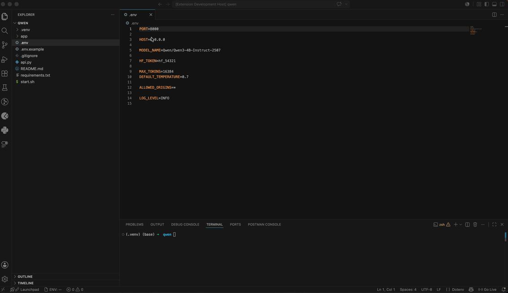

# EnvSwitch — .env Profile Manager

> Switch between dev, staging, and prod `.env` profiles in one click.
> Secrets live in the **OS keychain** — never as plaintext files in your repo.


[](https://github.com/bobsk8/env-switch)



---

## The problem every developer knows

You're juggling `.env.dev`, `.env.staging`, `.env.prod` sitting inside your project.
One accidental `git add .` and your API keys are in the commit history — **forever**.

EnvSwitch removes those files from the equation.
Every secret is stored in your OS keychain (macOS Keychain, Windows Credential Manager, Linux libsecret).
Nothing sensitive ever touches disk.

---

## How it stands out

| | EnvSwitch | File-based switchers |
|---|:---:|:---:|
| Secrets stored in OS keychain | ✅ | ❌ plaintext on disk |
| Validation against `.env.example` | ✅ | ❌ |
| Search a variable across all profiles | ✅ | ❌ |
| Side-by-side profile diff | ✅ | ❌ |
| Snapshot history + one-click restore | ✅ | ❌ |
| One-click switching | ✅ | ✅ |
| Works without extra config files in the repo | ✅ | ❌ |

---

## Features

- **Multiple profiles per workspace** — dev, staging, prod, or any name you want
- **One-click activation** from the sidebar, status bar, or Command Palette
- **Validation vs `.env.example`** — instantly see missing, empty, and extra keys
- **Variable search** across all profiles with masked values by default
- **Side-by-side diff** between any two profiles
- **Snapshot history** — every activation saves a restore point (last 5 snapshots)
- **Import** from an existing `.env` file when creating a profile
- **Auto-sync** — edits to the active `.env` file on disk are automatically picked up

---

## Quick Start

1. Click the **EnvSwitch icon** in the Activity Bar (left sidebar).
2. Press **+** to create your first profile.
3. Give it a name (`dev`, `prod`, etc.) and confirm the target file (`.env`).
4. Choose to **import** your current `.env` or start empty.
5. Click the profile to **activate** it — done.

Switch anytime via the **ENV** button in the status bar or `Ctrl+Shift+P` → `EnvSwitch: Switch Profile`.

---

## Usage

### Validate against .env.example

Right-click any profile → **Validate vs .env.example**.

| Result | Meaning |
|--------|---------|
| Missing | Required by `.env.example` but absent from this profile |
| Empty | Key exists but has no value |
| Extra | Present in profile but not in `.env.example` |

### Search a variable across profiles

Click the 🔍 icon in the EnvSwitch view header, or run `EnvSwitch: Search Variable`.

- Pick a key to see its value in **every profile at once**
- Values are masked by default — reveal only when you choose to
- Copy to clipboard directly from the results

### Compare two profiles

Click the diff icon in the view header, or run `EnvSwitch: Compare Profiles`.
Opens a native VS Code diff editor with the two profiles side by side.

### View history and restore

Right-click a profile → **View History**.
Each activation creates a snapshot. Pick one to restore.

---

## Security

- All profile content is stored exclusively in the **OS keychain** (never written to disk in plaintext)
- Search results mask secret values by default
- Profiles are scoped per workspace
- The extension makes no network requests

---

## Requirements

- VS Code 1.120.0 or later
- A workspace folder must be open

---

## Development

```bash
git clone https://github.com/bobsk8/env-switch.git
cd env-switch
npm install
npm run compile   # build once
npm run watch     # watch mode
```

Press `F5` in VS Code to launch the Extension Development Host.

To generate the `.vsix` package:

```bash
npm run package
```

---

## Source Code & Transparency

This extension is **fully open source**. You can inspect every line of code, verify that no secrets leave your machine, and contribute or report issues on GitHub:

👉 **[github.com/bobsk8/env-switch](https://github.com/bobsk8/env-switch)**

---

## License

MIT
